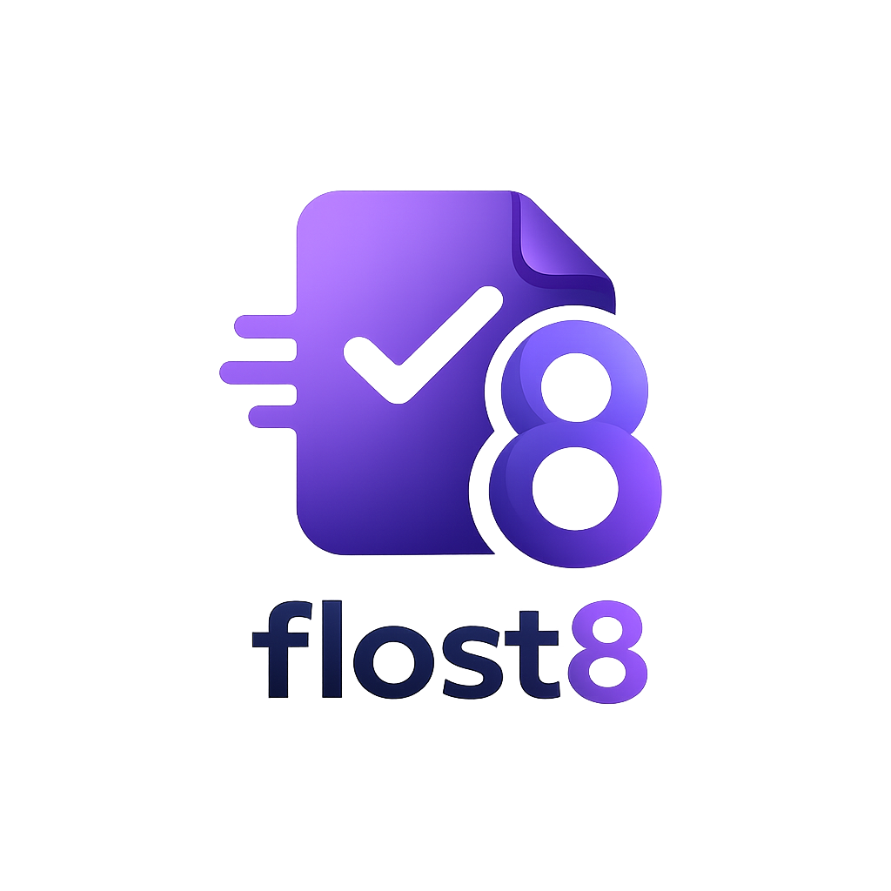
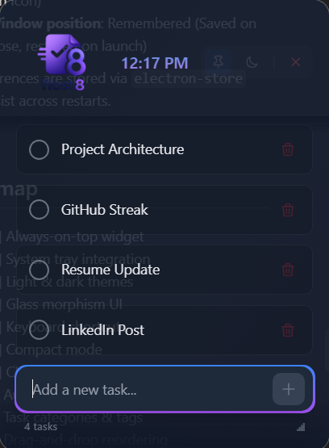
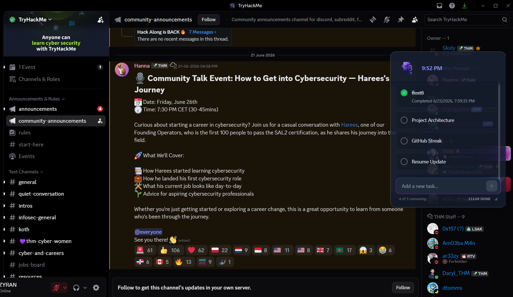
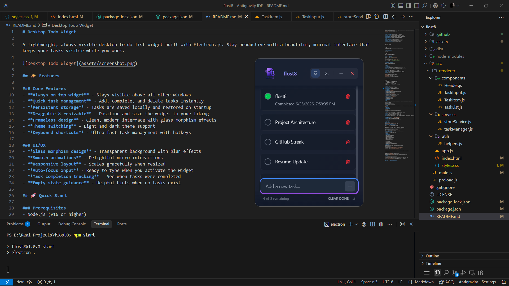
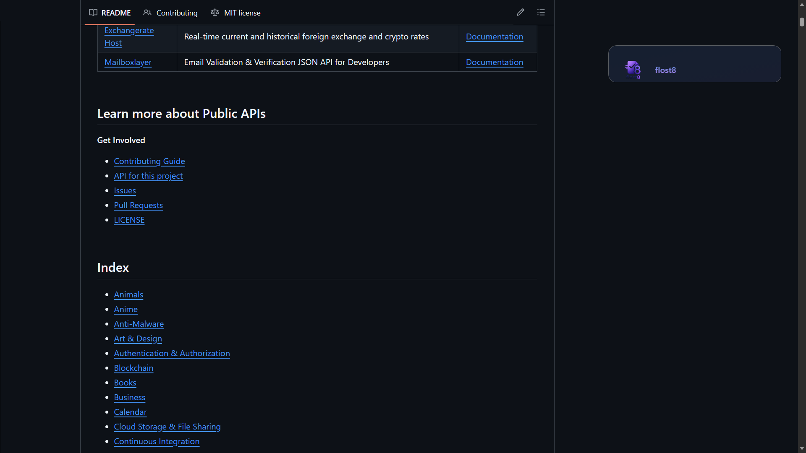

<p align="center">
  
</p>

<h1 align="center">flost8</h1>

<p align="center">
  <strong>An uncompromisingly minimal, always-visible desktop task manager.
  Stay productive. Never lose track of what matters.</strong><br>
</p>

<p align="center">
  <a href="#-downloads"></a>
  <a href="LICENSE"></a>
  <a href="https://www.electronjs.org/"></a>
  <a href="https://tailwindcss.com/"></a>
</p>

---

<p align="center">
  
</p>

<br>

flost8 is a lightweight utility engineered to solve a single problem: context switching. By floating a persistent, frameless interface above your workspace, it ensures your immediate priorities remain visible without burying them in browser tabs or requiring you to minimize your IDE.

<br>

## Downloads

<p align="center">
  <a href="https://github.com/singharyan006/flost8/releases/download/v2.0.0/flost8.exe">
    
  </a>
  &nbsp;&nbsp;
  <a href="https://github.com/singharyan006/flost8/releases/download/v2.0.0/flost8.dmg">
    
  </a>
</p>

<p align="center">
  <sub><a href="https://github.com/singharyan006/flost8/releases/latest">View all releases and changelogs →</a></sub>
</p>

<br>

## Highlights

- **Persistent Visibility:** Engineered to stay pinned above all applications, bypassing OS-level window layering restrictions.
- **Zero-Friction UX:** Pure keyboard-driven input (`Enter` to add, `Esc` to clear) with automatic restoration on system boot.
- **Glass Morphism Engine:** Utilizes backdrop blurring and transparent window constraints to maintain context of the applications beneath it.
- **Cross-Platform:** Distributed via NSIS (Windows) and DMG (macOS) with native system tray integration on both operating systems.

<br>

## In Action

<p align="center">
  <em>Works seamlessly over any application — Discord, VS Code, browsers, and more.</em>
</p>

<table>
  <tr>
    <td align="center" colspan="2">
      <br>
      <sub><b>Desktop View</b> — Clean integration with your desktop environment</sub>
    </td>
  </tr>
  <tr>
    <td align="center" width="50%">
      <br>
      <sub><b>Over Discord</b> — Track tasks while chatting</sub>
    </td>
    <td align="center" width="50%">
      <br>
      <sub><b>Over VS Code</b> — Keep your to-do list visible while coding</sub>
    </td>
  </tr>
  <tr>
    <td align="center" colspan="2">
      <br>
      <sub><b>Compact Mode</b> — Minimal footprint when you need more screen space</sub>
    </td>
  </tr>
</table>

<br>

## Technical Architecture

flost8 is built on a strict, security-first Electron architecture separating the Node.js backend from the Chromium frontend.

```text
flost8/
├── src/
│   ├── main.js                    # Main process (System integration, Window management)
│   ├── preload.js                 # IPC Bridge (Context-isolated API exposure)
│   └── renderer/
│       ├── index.html             # View layer
│       ├── app.js                 # State management & Event delegation
│       ├── styles.css             # Tailwind v4 compiled utilities
│       ├── components/            # Modular DOM constructors
│       ├── services/              # Pure business logic (Task Manager, Storage)
│       └── utils/                 # Helper functions and formatters
├── assets/                        # Distribution binaries & icons
└── .github/workflows/             # CI/CD automated build pipelines
```

### Engineering Decisions

- **State Management:** Handled locally via `electron-store` synchronously to ensure zero data loss on unexpected process termination.
- **Styling:** Migrated entirely to **Tailwind CSS v4**, removing the need for a configuration file and relying solely on CSS variables and native rendering.
- **DOM Manipulation:** Operates without virtual DOM overhead (no React/Vue). Pure vanilla JavaScript event delegation provides instant feedback loops.

<br>

## Security Model

The application strictly adheres to the Electron security guidelines to prevent arbitrary code execution:

1. `nodeIntegration: false` — The renderer process has zero access to Node.js APIs.
2. `contextIsolation: true` — The preload script runs in an isolated V8 context.
3. **Strict IPC:** Communication between the UI and system layers happens exclusively through an explicitly defined `window.electronAPI` bridge.
4. **Input Sanitization:** All user inputs are HTML-escaped before DOM insertion to prevent Cross-Site Scripting (XSS).

<br>

## Development Setup

<details>
<summary><b>View instructions for building from source</b></summary>

<br>

Requires [Node.js](https://nodejs.org/) v20+

```bash
# Clone and install dependencies
git clone https://github.com/singharyan006/flost8.git
cd flost8
npm install

# Run in development mode with hot-reload
npm run dev

# Compile distribution binaries
npm run build:win    # Windows (.exe)
npm run build:mac    # macOS (.dmg)
```
</details>

<br>

## License

Distributed under the MIT License. See `LICENSE` for more information.

---

<p align="center">
  <br>
  <strong>Engineered by <a href="https://github.com/singharyan006">Aryan Singh</a></strong>
  <br>
  Focus on what matters most
</p>
